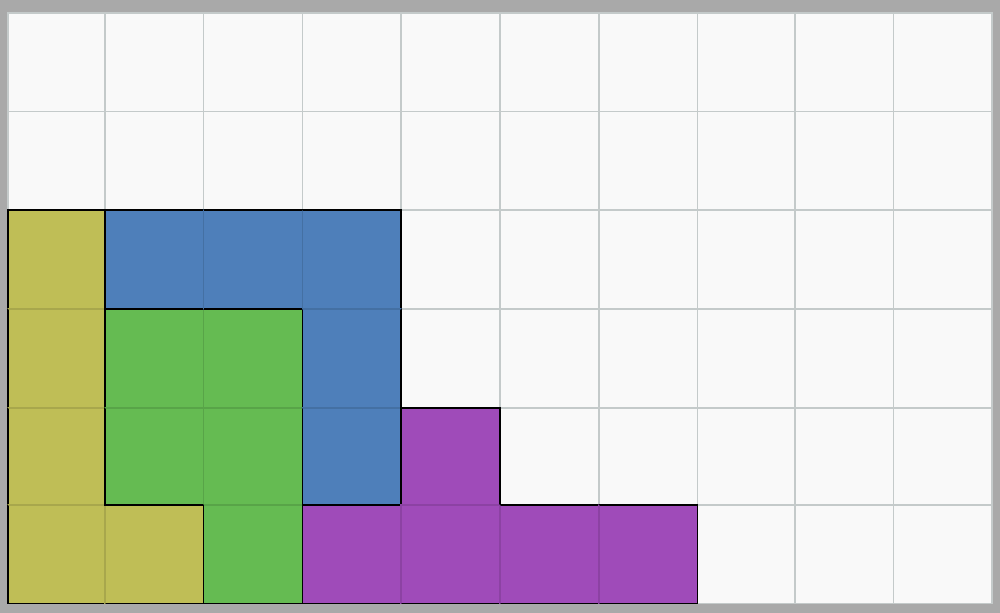

# Pentomino Digital

* Das Spiel Pentomino (mitunter auch Pentominos genannt) wird in der Mathematikdidaktik eingesetzt um räumliches Vorstellungsvermögen sowie Verdergrund-Hintergrund-Unterscheidung zu trainieren.
* Pentominos sind Quadratfünflinge. Nimmt man 5 Quadrate und setzt sie aneinander, kann man 12 verschiedene Figuren bilden.

* Die Steine werden in der Regel mit den Buchstaben benannt, denen sie ähnlich sehen (manche mehr, manche weniger): FILNPUVWXYZ

* Beim Pentomino-Spiel ist es nun die Aufgabe, mit diesen Steinen ein Spielbrett komplett zu bedecken. Hier zu sehen ist ein ganz klassisches Pentomino-Spiel mit Holz-Steinen, die einen Kasten mit einer Grundfläche von 6x10 füllen sollen.

* Günstigere Pentomino-Spiele, gerade für den Schulbedarf lassen sich aus Papier leicht selbst herstellen

## Pentominos lösen ist schwer bis unmöglich.

* Die Aufgabe, die hier gelöst werden soll, ist nicht schwer zu verstehen.
* Tatsächlich zu einer Lösung zu kommen ist jedoch sehr schwer, denn man kann oft nicht erkennen, ob man auf dem Weg zu einer Lösung ist oder ob keine Lösung mehr möglich ist.
* Es gibt für dieses 6x10-Feld fast 10.000 verschiedene Lösungen und viel viel mehr Ansätze, die eben keine Lösung sind

* Folgende Abbildung zweigt sehr ähnliche Situationen. Eine ist noch lösbar, die andere nicht. Können Sie erkennen, welche lösbar ist?
* Selbst wenn Sie den Pentomino-Röntgenblick haben, ist klar, dass hier die intendierte Wirkung im Schulunterricht nicht mehr erreicht wird.

* Bis klar wird, dass ein Spiel nicht mehr lösbar ist kann sehr lange dauern. In der folgenden Situation wurde das Spielfeld gut gefüllt. Es ist jetzt aber klar, dass es nicht lösbar ist. Wie kann man wieder zu einer lösbaren Situation kommen? (Lösung: Es müssen mindestens 5 Steine wieder entfernt werden. N,P,U,X,Z)

* Selbst wenn man wüsste, dass eine Situation noch lösbar ist (in der folgenden Abbildung der Fall) steht man vor einem Problem. Welchen Stein sollte man als nächstes wohin setzen? Woher will man das wissen? Wie will man einen Tipp geben?

## Situationen, die mehr Hinweise bieten

* Im folgenden Ameisen-Brett gibt es viele Bereiche, die schon auf den ersten Blick mit nur einem Stein gefüllt werden können.

* Gerade solche Situationen sind interessant, denn sie geben Anlass für eine Hypothese. So eine Situation auch bei den komplexeren Aufgaben herzustellen wäre sinnvoll, aber im klassischen, analogen Spiel geht das nicht.

## Digitale Hilfsfunktionen

* Grundlage nahezu jeder Hilfsfunktion ist es, dass die Lösungen des Bretts bekannt sind.
* Man kann alle Lösungen eines Bretts berechnen (Tiefensuche - Backtracking) und als Datei abspeichern
* [Beispiel: Alle Lösungen des 6x10-Boards](../boards/a_6x10.txt) ohne gespiegelte und gedrehte Versionen (2339 Einträge)
* Diese Lösungen kann eine App leicht dauerhaft im Speicher halten.

### Noch lösbar?
* Was kann man damit anfangen?
* Man kann die Sammlung aller Lösungen schnell durchgehen und mit der aktuellen Situation vergleichen Quadrat für Quadrat.
* Wenn alle belegten Positionen auf dem Feld in einer Lösung genau so vorkommt, dann ist das Spiel noch lösbar. 

### Wie wieder lösbar machen?
* Man kann aber für eine Lösung auch berechnen, wie ähnlich sie zur aktuellen Situation ist, also wie viele der Steine (und welche) man vom Brett nehmen müsste, damit die Lösung noch möglich wird. All die Lösungen, bei denen diese Steinzahl 0 ist, sind Lösungen. Sonst bestimmt man die Lösungen mit der geringsten Zahl an zu entfernenenden Steinen und kann dann Steine zur Entfernung vorschlagen.
* Es kann mehrere Möglichkeiten geben, das Spiel wieder lösbar zu machen (unten entweder V und Y oder P und V entfernen)

### Tipps zur weiteren Lösung geben ist schwer!

* ...
* ...
* ...

#### Besser lösbare Situation herstellen

* ...
* ...
* ...

#### Spieler:in einen Tipp zum setzen geben

* ...
* ...
* ...